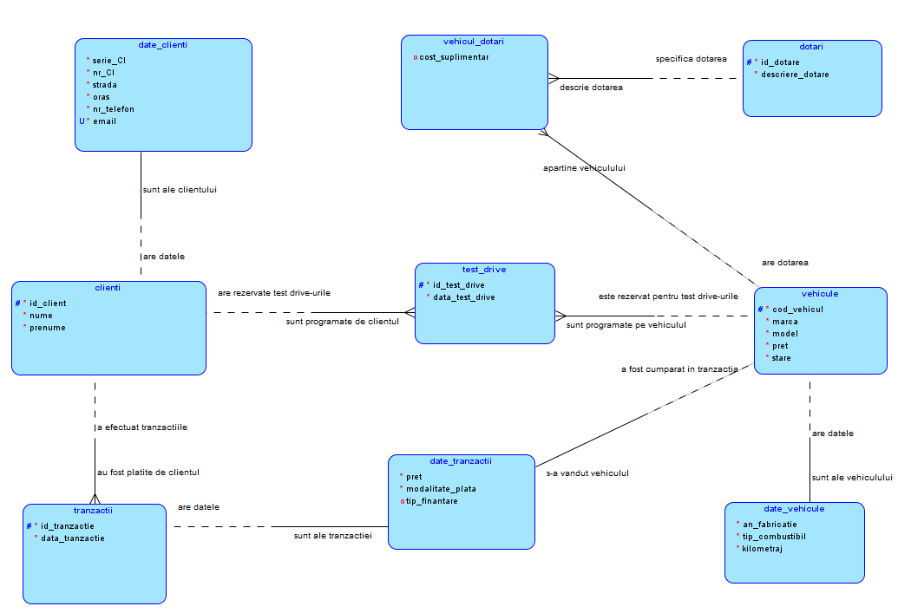
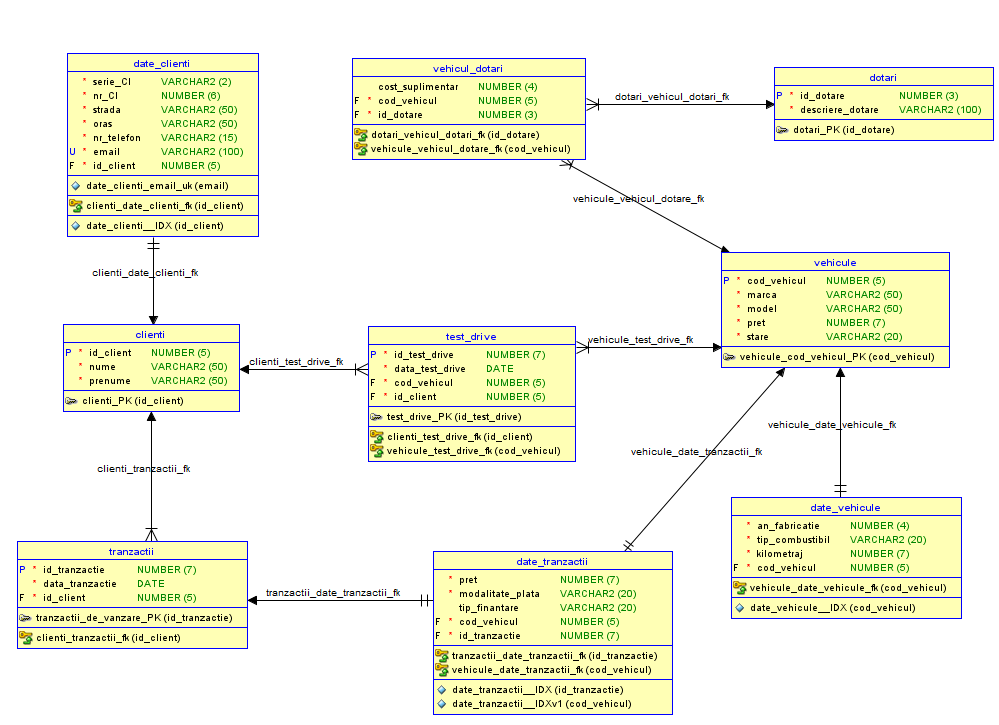

# **Car Dealership Management System**  

## **Project Description**  
The project aims to efficiently manage the operations of a car dealership, including **vehicle inventory, sales transactions, test drive scheduling, additional features, and customer details**. The application provides a structured **database-driven** approach to **visualizing and managing dealership activities**, reducing errors and ensuring **data integrity**.  

This system is designed to be **intuitive and balanced** between flexibility and complexity, utilizing well-defined **constraints** such as **primary keys, foreign keys, uniqueness, and type validations**. The database design follows **normalization principles** to **eliminate data redundancy** and optimize queries for **fast and secure data retrieval**.  

The project represents a **comprehensive solution** for dealership management, covering **vehicle administration, financial transactions, and customer interactions**. The structured **relational database** ensures **efficient data storage and manipulation**, maintaining both **integrity and accessibility**.  

---

## **Vehicle Management**  
The dealership maintains an inventory of **new and used vehicles**. Each vehicle is **registered in the database** with the following details:  

- **Brand and model**  
- **Year of manufacture**  
- **Fuel type** (gasoline, diesel)  
- **Price and condition** (new or second-hand)  

Additional data such as **mileage and maintenance history** are included, as these factors **influence vehicle pricing**. Vehicles can also have **customizable additional features**, such as:  

- **Rear cameras**  
- **Parking sensors**  
- **360° cameras**  
- **Panoramic sunroof**  

Each feature category contributes to **price adjustments**, providing a **dynamic pricing model** for each vehicle.  

---

## **Test Drive Management**  
A key functionality of the system is the **test drive scheduling module**, allowing customers to **book test drives** for available vehicles. The system enforces scheduling constraints, preventing **double-booking of the same vehicle** and ensuring **conflict-free appointments**.  

---

## **Vehicle Purchase Process**  
The purchasing process is well-defined, allowing customers to **buy vehicles outright** using multiple payment methods, including:  

- **Cash**  
- **Bank transfers**  
- **Financing options** (monthly installments with variable interest rates)  

The system ensures that each **vehicle can only be sold once**, enforcing **one-to-one constraints** between transactions and vehicles.  

---

## **Customer Management**  
Each customer is **registered with detailed personal information**, including:  

- **Full name**  
- **Identification document details** (serial and number)  
- **Address** (street, city)  
- **Phone number and email**  

These details are crucial for **identifying customers** and managing associated operations such as **purchases and test drives**. The system also provides a **comprehensive customer history**, enabling the dealership to **personalize the customer experience**.  

---

## **Transactions & Reporting**  
Sales transactions are a **core component** of the system, with each transaction recorded with:  

- **The purchased vehicle**  
- **The customer who made the purchase**  
- **Payment method**  
- **Financial details** (price, discounts, and special offers)  

The system also includes a **reporting module** that generates insights such as:  

- **Best-selling vehicle models**  
- **Most preferred payment methods**  
- **Financial performance analysis**  

These reports support **strategic decision-making** and help optimize the **dealership’s inventory management**.  

---

## **Technologies Used**  
- **Oracle SQL & PL/SQL** – Constraints, Triggers, Sequences, Indexes  
- **Entity-Relationship (ER) Modeling** – Chen Notation  
- **Data Normalization** – Reducing redundancy and optimizing queries  

This project delivers a **scalable, well-structured, and efficient** solution for **managing a car dealership’s operations**, ensuring **data accuracy, transaction security, and operational efficiency**. 

## Logical Model

## Relational Model

# **Structural Explanations**  

The database is designed to efficiently manage the operations of a car dealership. It consists of the following key entities:  

## **Main Entities**  

- **clients**  
  Manages personal information about customers, such as first name, last name, and a unique client identifier.  

- **client_details**  
  Stores additional details about clients, including ID card series and number, address, phone number, and email. This entity is directly associated with the **clients** table.  

- **vehicles**  
  Represents the cars available in the dealership, including details such as brand, model, price, condition (new or used), and other relevant information.  

- **vehicle_details**  
  Contains additional characteristics of each vehicle, such as manufacturing year, fuel type, and mileage. This entity is directly associated with the **vehicles** table.  

- **features**  
  Stores details about optional features available for vehicles, such as audio system, parking sensors, and other additional functionalities.  

- **vehicle_features**  
  Establishes the relationship between vehicles and their features, including the extra cost associated with each feature.  

- **transactions**  
  Tracks purchase records made by clients, including the transaction date and the relationship between the client and the purchased vehicle.  

- **transaction_details**  
  Provides financial details related to transactions, such as the final price, payment method, and financing details. This entity is directly associated with the **transactions** and **vehicles** tables.  

- **test_drive**  
  Manages test drive appointments for clients, including information about the client, the vehicle, and the scheduled test drive date.  

---

## **Entity Relationships**  

### **1. clients - client_details**  
- **Relationship:** 1:1  
- Each client has a unique set of additional details (address, phone number, email). Each record in **client_details** belongs to a single client. This relationship helps separate personal information from contact and address details.  
- **Foreign Key:**  
  - `client_id` in **client_details** references `client_id` in **clients**.  

### **2. clients - test_drive**  
- **Relationship:** 1:M  
- A client can schedule multiple test drives for different vehicles, but each test drive is associated with only one client. This relationship enables tracking of individual test drives for each client.  
- **Foreign Key:**  
  - `client_id` in **test_drive** references `client_id` in **clients**.  

### **3. clients - transactions**  
- **Relationship:** 1:M  
- A client can make multiple purchase transactions, but each transaction is linked to a single client. This relationship maintains the purchase history of each client.  
- **Foreign Key:**  
  - `client_id` in **transactions** references `client_id` in **clients**.  

### **4. vehicles - transaction_details**  
- **Relationship:** 1:1  
- Each vehicle can be sold in a single transaction, and each transaction is associated with a single vehicle. This relationship is necessary for tracking the financial details of each purchase.  
- **Foreign Key:**  
  - `vehicle_id` in **transaction_details** references `vehicle_id` in **vehicles**.  

### **5. transactions - transaction_details**  
- **Relationship:** 1:1  
- Each transaction has associated financial details, such as the total price, payment method, and financing type. Each set of financial details is linked to a single transaction.  
- **Foreign Key:**  
  - `transaction_id` in **transaction_details** references `transaction_id` in **transactions**.  

### **6. vehicles - vehicle_details**  
- **Relationship:** 1:1  
- Each vehicle has additional information, such as manufacturing year, fuel type, and mileage. This relationship is 1:1 because these details are unique for each vehicle.  
- **Foreign Key:**  
  - `vehicle_id` in **vehicle_details** references `vehicle_id` in **vehicles**.  

### **7. vehicles - test_drive**  
- **Relationship:** 1:M  
- A vehicle can be associated with multiple test drives since multiple clients may request to test the same vehicle. Each test drive is associated with a single vehicle.  
- **Foreign Key:**  
  - `vehicle_id` in **test_drive** references `vehicle_id` in **vehicles**.  

### **8. vehicles - vehicle_features**  
- **Relationship:** 1:M  
- A vehicle can have multiple features, such as a multimedia package or heated seats. Each feature is linked to a specific vehicle.  
- **Foreign Key:**  
  - `vehicle_id` in **vehicle_features** references `vehicle_id` in **vehicles**.  

### **9. features - vehicle_features**  
- **Relationship:** 1:M  
- A feature (such as an audio system or a safety package) can be associated with multiple vehicles, but each record in **vehicle_features** is linked to a specific feature.  
- **Foreign Key:**  
  - `feature_id` in **vehicle_features** references `feature_id` in **features**.  

## Database Structure and Table Interrelationships

The database design follows normalization rules up to the Third Normal Form (3NF) to eliminate redundancies and ensure data integrity. This is achieved by splitting the data into distinct tables, connected through primary and foreign keys.

- **1NF (First Normal Form)**: All column values are atomic, and there are no repeating value groups.
- **2NF (Second Normal Form)**: All non-key columns depend entirely on the primary key.
- **3NF (Third Normal Form)**: There are no transitive dependencies between non-key columns.

# Constraints Used and Their Justification

## 1. Primary Key Constraints  
These constraints ensure the uniqueness of each row in the table, guaranteeing unique identification of records.  

- **Entity: `clients`**  
  - **Primary Key: `clients_pk`** - This attribute is unique for each client and allows individual identification. Without this constraint, distinguishing between two clients with the same name would be difficult.  

- **Entity: `vehicles`**  
  - **Primary Key: `vehicles_cod_vehicle_pk`** - Ensures the uniqueness of each registered vehicle. This key is crucial for tracking and managing vehicles in other tables such as `test_drive` or `transaction_data`.  

- **Entity: `features`**  
  - **Primary Key: `features_pk`** - Uniquely identifies each type of feature. This prevents redundancy and maintains data integrity in `vehicle_features`.  

- **Entity: `transactions`**  
  - **Primary Key: `transactions_sale_pk`** - Allows unique identification and management of each transaction, which is necessary for correlation with other tables.  

- **Entity: `test_drive`**  
  - **Primary Key: `test_drive_pk`** - Prevents duplication of records for the same test drive performed by a client for a vehicle on a specific date.  

## 2. Foreign Key Constraints  
Foreign key constraints ensure consistency in relationships between tables and prevent data integrity violations.  

- **`clients` - `client_data`**  
  - **Foreign Key: `clients_client_data_fk`** refers to the primary key in `clients` (`id_client`). Ensures that each set of additional information is associated with an existing client.  

- **`features` - `vehicle_features`**  
  - **Foreign Key: `features_vehicle_features_fk`** refers to the primary key in `features` (`id_feature`). Prevents assigning a non-existent feature to a vehicle.  

- **`vehicles` - `vehicle_features`**  
  - **Foreign Key: `vehicles_vehicle_features_fk`** refers to the primary key in `vehicles` (`id_vehicle`). Ensures that features are associated only with existing vehicles.  

- **`clients` - `test_drive`**  
  - **Foreign Key: `clients_test_drive_fk`** refers to the primary key in `clients` (`id_client`). Every test drive must be linked to a valid client.  

- **`vehicles` - `test_drive`**  
  - **Foreign Key: `vehicles_test_drive_fk`** refers to the primary key in `vehicles` (`cod_vehicle`). Ensures that test drives are only conducted for existing vehicles.  

- **`transactions` - `transaction_data`**  
  - **Foreign Key: `transactions_transaction_data_fk`** refers to the primary key in `transactions` (`id_transaction`). Ensures that transaction details are linked to existing transactions.  

- **`vehicles` - `transaction_data`**  
  - **Foreign Key: `vehicles_transaction_data_fk`** refers to the primary key in `vehicles` (`cod_vehicle`). Ensures that only registered vehicles can be included in a transaction.  

- **`clients` - `transactions`**  
  - **Foreign Key: `clients_transactions_fk`** refers to the primary key in `clients` (`id_client`). Links transactions to existing clients, preventing a transaction from existing without an associated client.  

- **`vehicles` - `vehicle_data`**  
  - **Foreign Key: `vehicles_vehicle_data_fk`** refers to the primary key in `vehicles` (`cod_vehicle`). Ensures that each set of additional data is associated with a registered vehicle.  

## 3. Unique Key Constraints  
Unique constraints are used to prevent data duplication in columns that must contain unique values.  

- **Entity: `client_data`**  
  - **Unique Constraint: `client_data_email_uk`** on the `email` column - Each email address must be unique to prevent duplicate records. This helps prevent errors and ensures correct communication with clients.  

## 4. NOT NULL Constraints

NOT NULL constraints are used to ensure that certain columns cannot have null values, preventing omissions in critical information.

## Entity: `clients`
- **id_client**: The client identifier is fundamental for linking with other entities. If this value were null, table relationships would become invalid, making client data management impossible.
- **nume (name)**: It is crucial to know the client's name for identification. A client without a name cannot be used in business processes.
- **prenume (surname)**: Similar to the name, the surname is necessary for unique client identification. It is essential for personalized interactions and avoiding confusion in case of clients with identical names.

## Entity: `client_data`
- **serie_c (ID series)**: The identity card series is required to validate the client's identity. Without this value, identity verification would be incomplete.
- **nr_ci (ID number)**: The identity card number, along with the series, ensures uniqueness in identifying each client. This value prevents errors in case of duplicate records.
- **strada (street)**: The client's address is essential for communication, deliveries (if applicable), or processing official documents. A client without an address would be incompletely defined.
- **oras (city)**: The city is necessary to know the client's location. It is useful for customer segmentation and other business analyses.
- **nr_telefon (phone number)**: The phone number is indispensable for quick contact with the client, whether for order confirmation, scheduling a test drive, or resolving issues.
- **email**: The email is a primary communication channel in many processes (confirmations, invoices, offers).
- **id_client**: This is the foreign key linking `client_data` to `clients`. If null, the connection between additional information and the client would be lost.

## Entity: `vehicles`
- **cod_vehicul (vehicle code)**: Each vehicle must have a unique code for identification. Without this value, vehicles would be impossible to manage in the database.
- **marca (brand)**: The brand is a key attribute for vehicles. Without this information, the vehicle could not be properly presented or classified.
- **model**: The model completes the vehicle identification. A vehicle without a model could not be adequately described to clients.
- **pret (price)**: The price is crucial for any transaction. A vehicle without a price cannot be sold, and the absence of this information would make the data incomplete.
- **stare (condition)**: It is necessary to know whether the vehicle is new or second-hand for transparency with the client and to determine its precise value.

## Entity: `vehicle_data`
- **an_fabricatie (manufacturing year)**: The manufacturing year is essential for evaluating the vehicle and determining its market value.
- **tip_combustibil (fuel type)**: The fuel type is necessary to classify vehicles based on technical specifications, useful for clients and maintenance.
- **kilometraj (mileage)**: Mileage reflects the vehicle's usage, a crucial piece of information for assessing its technical and commercial condition.
- **cod_vehicul**: The vehicle code is the foreign key linking `vehicle_data` to `vehicles`. Without this, the connection between entities would be lost.

## Entity: `features`
- **id_dotare (feature ID)**: The feature identifier must be unique and mandatory; otherwise, linking vehicles with their additional features would not be possible.
- **descriere_dotare (feature description)**: It is essential to know what each feature represents. Without a description, the feature would be useless and create confusion.

## Entity: `vehicle_features`
- **cod_vehicul**: Required to associate additional features with specific vehicles. Without this information, features could not be correlated with vehicles.
- **id_dotare**: Identifies the specific feature associated with a vehicle. Necessary to correctly link features with vehicles.
- **cost_suplimentar (extra cost)**: The additional value is essential for calculating the final vehicle price.

## Entity: `transactions`
- **id_tranzactie (transaction ID)**: This column uniquely identifies each transaction. Without it, transaction tracking would become impossible.
- **data_tranzactie (transaction date)**: The transaction date is crucial for chronological records and reports. Without it, sales tracking would not be possible.
- **id_client**: It is necessary to know which client performed the transaction. Without this information, the link between clients and transactions would be lost.

## Entity: `transaction_data`
- **pret (price)**: The transaction value is mandatory for accounting and financial reports.
- **modalitate_plata (payment method)**: It is necessary to know how the payment was made (e.g., cash, card, financing). Without this information, the transaction could not be correctly recorded.
- **cod_vehicul**: It is essential to know which vehicle is involved in the transaction. Without this link, vehicle purchases could not be tracked.
- **id_tranzactie**: The transaction identifier is essential for unique registration.

## Entity: `test_drive`
- **id_test_drive**: Each test drive must have a unique identifier for managing appointments.
- **data_test_drive (test drive date)**: It is important to know when the test drive was scheduled. Without this value, managing reservations would be impossible.
- **cod_vehicul**: Each test drive is associated with a specific vehicle. Without this information, it would not be possible to determine which vehicle is to be tested.
- **id_client**: It is necessary to know which client requested the test drive for record-keeping and contact.

## 5. CHECK Constraints (CK)

### Vehicles Entity:
- **vehicule_pret_ck (price >= 0)**: Ensures that all vehicles in the vehicles table have a valid price, meaning no negative values in the `price` column. Without this constraint, a user could accidentally insert a negative price, leading to inconsistent data or incorrect reports.
- **vehicule_stare_ck**: Restricts the allowed values in the `state` column to two options: "new" or "second-hand". This constraint prevents the insertion of illogical values like "repaired" or other inappropriate descriptions.

### Vehicle Data Entity:
- **date_veh_tip_comb_ck**: This constraint checks that values in the `fuel_type` column are only among the allowed options: 'Gasoline', 'Electric', 'Hybrid', or 'Diesel'. It prevents invalid or erroneous values from being inserted, ensuring that the fuel type is one that is recognized and used in practice.
- **date_veh_km_ck (mileage >= 0)**: This constraint ensures that the mileage value cannot be negative. It is logical that a vehicle cannot have negative mileage, so this constraint eliminates the possibility of data entry errors.

### Transaction Data Entity:
- **date_tranzactii_pret_ck (price >= 0)**: This constraint guarantees that the price of a transaction cannot be negative. It prevents the insertion of invalid values that could compromise financial reporting and transaction analysis.
- **veh_dotari_cost_supl_ck (additional_cost >= 0)**: This constraint checks that the value of the additional cost associated with vehicle features is positive or zero. Negative additional costs would be economically illogical, and this rule prevents such errors.

## 6. Indexes

- **date_clienti__idx**: This unique index on the `id_client` column in the `date_clienti` table optimizes searches and access to client data. It also ensures that each client has exactly one set of associated data, strengthening the relationship with the `clienti` table.
- **date_tranzactii__idx**: Defined on the `id_tranzactie` column in the `date_tranzactii` table, this unique index improves the performance of search operations and ensures the uniqueness of each transaction identifier.
- **date_tranzactii__idxv1**: This unique index on the `cod_vehicul` column in the `date_tranzactii` table prevents the association of a vehicle with multiple transactions at the same time, respecting the 1:1 rule between vehicle and transaction.
- **date_vehicule__idx**: Created on the `cod_vehicul` column in the `date_vehicule` table, this unique index ensures that each vehicle has a unique set of associated details, facilitating the management of vehicle information.

## 7. Triggers

- **clienti_id_client_trg**: This trigger automatically generates values for the `id_client` column in the `clienti` table using the `clienti_id_client_seq` sequence. It is activated before each row insertion and applies only when the `id_client` column is left null. This constraint ensures the uniqueness and consistency of client IDs, eliminating errors caused by manual ID allocation.
- **dotari_id_dotare_trg**: This trigger is used to assign unique IDs to the `id_dotare` column in the `dotari` table using the `dotari_id_dotare_seq` sequence. By being activated before insertion, the trigger ensures that each feature has a unique identifier, which simplifies the management and identification of vehicle features.
- **test_drive_id_test_drive_trg**: Using the `test_drive_id_test_drive_seq` sequence, this trigger ensures automatic generation of IDs for the `id_test_drive` column in the `test_drive` table. Activated before insertion, it simplifies the management of test drives and prevents identification conflicts.
- **tranzactii_id_tranzactie_trg**: This trigger automates the allocation of IDs for transactions using the `tranzactii_id_tranzactie_seq` sequence. It is activated before the insertion of a new row in the `tranzactii` table, ensuring the uniqueness of each transaction and maintaining integrity between transactions and other entities in the system.
- **vehicule_cod_vehicul_trg**: By using the `vehicule_cod_vehicul_seq` sequence, this trigger automatically generates unique values for the `cod_vehicul` column in the `vehicule` table. Activated before insertion, the trigger eliminates the risk of duplicating vehicle codes and optimizes their management process.

## 8. Autoincrement

- **id_client column in the clienti table**: Autoincrement is managed through the `clienti_id_client_seq` sequence, which starts at value 101 and does not cache values. This sequence is used in conjunction with the `clienti_id_client_trg` trigger, which automatically inserts a unique ID for each client, eliminating the need for manual intervention.
- **id_dotare column in the dotari table**: The `dotari_id_dotare_seq` sequence, which starts at value 501, is used to generate unique values automatically. The `dotari_id_dotare_trg` trigger completes the process by assigning unique identifiers to vehicle features.
- **id_test_drive column in the test_drive table**: Autoincrement is ensured by the `test_drive_id_test_drive_seq` sequence, configured to start at value 10001. This sequence is linked to the `test_drive_id_test_drive_trg` trigger, which automates ID allocation for each test drive.
- **id_tranzactie column in the tranzactii table**: The `tranzactii_id_tranzactie_seq` sequence, starting at value 5001, manages the autoincrement of the `id_tranzactie` column in the `tranzactii` table. The `tranzactii_id_tranzactie_trg` trigger facilitates this process, ensuring the uniqueness of each transaction.
- **cod_vehicul column in the vehicule table**: Autoincrement is provided by the `vehicule_cod_vehicul_seq` sequence, which starts at value 1001. This is automatically implemented through the `vehicule_cod_vehicul_trg` trigger, which assigns unique codes for each vehicle added to the system.

